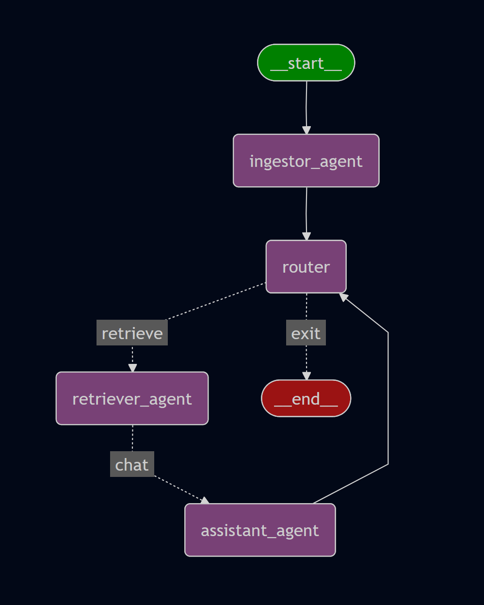

# Mind Palace

**Mind Palace** is an agentic AI system designed for intelligent document storage and retrieval. It leverages multi-agent architecture and Retrieval-Augmented Generation (RAG) to provide accurate and context-aware answers from your document collection.

## Features

- **Document Storage:** Store documents in a vector database for efficient semantic search.
- **Retriever Agent:** Retrieves relevant information from the vector database and enhances the user prompt.
- **LLM Chat Assistant:** Processes the enhanced prompt and generates answers using a large language model.
- **Agentic Workflow:** Modular agents collaborate to deliver precise and context-rich responses.

## How It Works

1. **Ingestion:** Documents from "knowledge_source_files" folder are embedded and stored in a vector database.
2. **Query:** User submits a question.
3. **Retrieval:** The Retriever Agent searches the vector database for relevant content and augments the prompt.
4. **Response:** The enhanced prompt is sent to the LLM Chat Assistant, which generates a comprehensive answer.



## Use Case

Can be used as a fully offline personal knowledge repo that can be queried locally by chatting an LLM assistant.


## Getting Started

1. Download and install ollama from [Official Ollama Site](https://ollama.com/download)
2. Download llm model llama3.2 and embedding model mxbai-embed-large by running 
```ollama pull llama3.2; ollama pull mxbai-embed-large```
3. Install python package manager uv with command```pip install uv``` 
4. Run in cmd ```uv run app.py```. This will automatically install all depedencies and run the program

A dummy source file has already been added to ./knowledge_source_files
so you can just ask about the info present in the file to the agent.

To add more files, add them to ./knowledge_source_files

## License

MIT License
